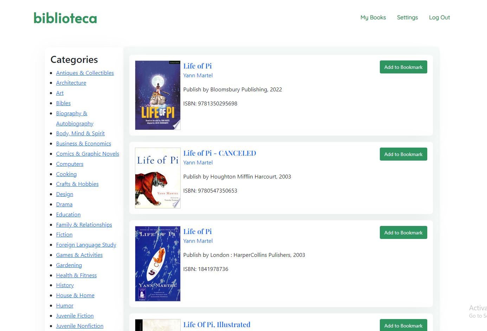

# biblioteca
#### Video Demo: https://www.youtube.com/watch?v=nolPQZXl3Ak&t=1s
#### Description:
biblioteca: A book lookup web application which let users to search for books on the web with titles, author name or ISBN numbers. Even the webpage provides a big list of categories if the user doesn't have something in his mind what to read next.

# Technologies

- Flask
- Python
- SQLite
- Javascript
- HTML
- CSS
- Bootstrap 5

# Features

## Sign Up

First you need to sign up in order to use this web app. And the form validation is done at the server side. The user can have any userename and passward of their choice. But the username has to be **unique**.

## Login

When everytime anyone tries to access this site if they are logged out or session has expired they will be redirected to the login page. Here again we are doing the validation on the server side. Although I can have absoultely do in on both client site and server side but chose to do on the latter side. If the user failed to provide correct user name and password they will get *HTTP* 400 status code back from the server. And if all the user input is correct they will be redirected to the homepade or index page.

## Home / Index page

Here as we can see the user after logging in can search book via title or author name or via ISBN number. They can make the query any way they want. Like doing the query by giving input for every field or they can do it just giving input to any of the two fields or just by giving one input to any of the fields.

But if the user submit the form **without** giving any input they will get *HTTP* 400 status code back from the server. Here again we are doing the validation on the server side. Yes we could have done it one the client side maybe it would make more sense. But It's okay doing it only one the server side isn't too bad either.

But if the user makes a valid query, the server will first validate the input then it will try to retrive data from the google database. If it receive data from the google book database it will first refine the data to check all the information we does exist on data that we recived. Then the server will redirect the user to the search result page with all valid response from it got from the google database.

but if the user gives some wrong input or the server didn't get any valid response from the google database then the server will still redirected to us to result page but now it will show `no results found`.

Now let's come back to our search results. We can bookmark any books from here we want. And for bookmarking we are using the fetch API for sending the data back to server. We are using the fetch API cause we absoulety don't want to realod our page every time we choose to bookmark any stuff. So now when the user choose to bookmark anything only after then the remove button will show under it cause cause if haven't bookmarked anything there is nothing to remove.

And with the remove button the user can remove it from his bookmark on the go if he had sudden change of a mind. But the remove button is clicked it will go away and the add to bookmark button will become active again. In both of the cases we are talking to our server using the fetch API.

Now if we come back to the search resluts. We can see a lot of details about each book. We can click on the title it will take us to google books preview page. Or if we click on the author name our server will take us to a new page with all books written by the author.

Now we can also see many categories listed up on the left side of our webpage if we are viewing it from the our desktop or if we are on the mobile page it will on the bottom of the page. Here if can click any of the categories to get the books based on each categories. We had this category option earlier to in our homepage although yea it was pretty cooler one. with fancy veritcal slider and all that.

## My books

Here we can see all our bookmarked stuff. Yes we can remove our bookmarks from here too. That's why We have remove button here. Or if there isn't any bookmark at all it will `no bookmarks yet`

## Settings

On the settings we can change our username and password. Here we rather interesting stuff going on. Here we are using a fetch API for form validation. If the user tries to submit the form without any input it won't simply able to do it. The user will see what error it made on his part in small message which appear under the text field where it made an error. And if user enter all the correct input the changes will be made.

